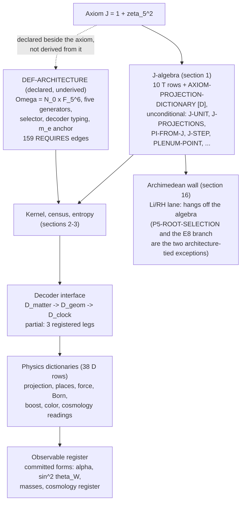

# TWIST-J architecture map: core, conscious interposers, holes

Date: 2026-07-18. Anchor: Public Canon v10, tag `canon-v10`, content commit
`817275c4ef460d2d500a947db34c975baa651c40`.

**Non-normative.** This note is an orientation map over the Public Canon. It
introduces no claim, moves no status, and is not evidence for anything.
`canon/REGISTRY.tsv` remains the only authority; where this note and the
registry disagree, the registry wins.

**Purpose.** Map the whole physics of TWIST-J at one altitude: what is
rigorous core, what is a conscious interposer (CZ "vedomy mezikus": a declared
bridging piece that fits and is known to be declared), and where the decoder
has genuine deaf spots. Every interposer is named, located, and given its
tightening path, so the program can close them one by one instead of
forgetting they exist.

CZ: Tato mapa deli program na tri vrstvy. Jadro (status T) drzi: 90 presnych
vet, vetsina s dvouarchitekturni reprodukci. Vedome mezikusy jsou vsechny
radky D, C a H plus deklarovane vstupy bez vlastniho radku (architektura
jadra, magneticky par, koeficient A_GD, slip X, Kahlerova metrika, kotva
m_e, klasicke importy).
Hlucha mista jsou radky O: 22 registrovanych der, z toho ctyri strukturni
brany a ctyri metrologicke, ktere drzi cely rozmerovy vystup dekoderu.
Kazdy mezikus ma v teto mape polohu, co presne premostuje, a cestu k utazeni.

---

## 1. The one-page picture

The dependency graph of the registry is a two-root DAG:

Two facts shape everything below.

1. Only the section 1 J-algebra (the 10 T rows plus
   AXIOM-PROJECTION-DICTIONARY, which rests solely on section 1 theorems)
   and the Li/RH lane of the wall (PENTAGON-NORMALIZATION, the four no-gos,
   the three fired carriers, LAMBDA-COCYCLE-ANGLES, O-R2-K-JUNCTION-PIN)
   hang off the axiom with no path to the architecture hub. Two section 16
   rows are exceptions: P5-ROOT-SELECTION carries the uniform architecture
   edge, and the E8 branch (J-LI-E8-SHELL-MULTIPLICITY-NOGO with its fired
   carrier) routes into the hub through COLOR-MCKAY-E8. Every other claim
   carries the uniform dependency "conditional on the declared
   architecture". The single largest
   interposer of the program is therefore not any D row: it is
   DEF-ARCHITECTURE itself, the declared checkpoint space, generators,
   selector, decoder typing, and m_e anchor, with 159 incoming REQUIRES
   edges and no derivation from J. The canon says this openly ("a definition
   boundary, not an omitted reduction theorem").
2. All physical meaning is deliberately quarantined in D rows (the G2B
   dictionary firewall). The T layer holds algebra, finite group theory,
   chain complexes, and recurrences; the statement "this is gravity / charge
   / probability / color" is always a dictionary. This is a design choice,
   not an accident, and it is what makes the interposers enumerable.

Status inventory (from `canon/STATUS_COUNTS.tsv`):

| layer | statuses | count | reading |
|---|---|---|---|
| core | T | 90 | exact theorems (T-LOCK still 0) |
| conscious interposers | D / C / H | 38 / 21 / 6 | dictionaries, finite-range computations, live hypotheses |
| holes | O | 22 | registered deaf spots with decision conditions |
| boundary markers | F | 9 | falsified routes, kept as constraints |

Evidence classes: 104 two-architecture, 31 recorded-audit (all D or F),
12 one-architecture (all C), 39 inline-only (4 T, 9 D, 21 O, 5 H).

The six-layer protocol (L1 state, L2 manifold, L3 boundary, L4 support,
L5 stream, L6 measure) has exactly seven registered gates
(`canon/GATES.tsv`):

| gate | lift | kind | owner | state |
|---|---|---|---|---|
| GATE-L1-L5-LOG-PROJECTION | L1 -> L5 | definition projection | DEF-LOG-STREAM | closed by construction |
| GATE-L5-L6-BORN-READING | L5 -> L6 | dictionary lift | MEASURE-BORN-VERB [D] | declared reading |
| GATE-L1-L2-CURVATURE-CANONICAL | L1 -> L2 | open lift | CURVATURE-OPERATOR-CANONICAL [O] | open |
| GATE-L2-L3-GENERATIONS | L2 -> L3 | open lift | GENERATIONS-L3 [O] | open |
| GATE-L2-L5-ENTROPY-BRIDGE | L2 -> L5 | open lift | ENTROPY-LAYER-BRIDGE [O] | open |
| GATE-L4-L6-COLOR-MEASURE | L4 -> L6 | open lift | COLOR-MEASURE-SELECTION [O] | open |
| GATE-L5-L6-METRO-NORMALIZATION | L5 -> L6 | open lift | METRO-ADMISSIBILITY [O] | open |

Gate topology gaps worth stating exactly: nothing enters L4 from below,
there is no L3 -> L4 gate at all, no gate leaves L3, and L6 is reachable
only through the two L5 gates and the one L4 gate. Of the lifts that exist
into L5, one is a definition (L1) and one is open (L2, the entropy bridge);
none is a closed theorem. Under the declared rule "any lift between layers
requires its own named gate", a missing gate means no registered lift
exists on that edge.

---

## 2. Classification rule used in this map

- **Core**: registry status T. Exact, scope-qualified theorems. Scope
  qualifiers ("at scope", "no uniqueness claimed", "finite-functional
  scope") are part of the theorem, not decoration.
- **Conscious interposer (mezikus)**: anything declared and load-bearing
  that is not a theorem:
  - D rows: dictionary readings resting on named T rows, explicitly not
    derived and not unique;
  - C rows: finite-range computations standing where an all-scale theorem
    is wanted;
  - H rows: live hypotheses with registered falsifiers;
  - unregistered interposers: declared architecture, declared inputs
    (magnetic axiom pair, A_GD, the Kahler metric, slip X, m_e), named
    classical imports (Baker, zeta continuation, Li spectral package,
    self-duality of Z_N lattice gauge theory, Froehlich-Spencer class,
    E8 theta identities, Schwarzschild background), and prose imports
    (SO+(3,1) density, the 2 pi U(1) circle, the Klein-100 name, the
    coherent level-2 gauge).
- **Hole**: registry status O. Nothing registered yet; only the decision
  condition exists.
- **Boundary marker**: registry status F. Dead routes that actively
  constrain the search space (e.g. the entropy selection must be
  non-cylindrical because ENTROPY-CYLINDER-CUT fired).

---

## 3. The load-bearing skeleton

Interposers ranked by how much stands on them (from `DEPENDENCIES.tsv`,
`GATES.tsv`, and canon text):

| rank | interposer | status | what stands on it |
|---|---|---|---|
| 1 | DEF-ARCHITECTURE | declared | every claim outside section 1 and the Li/RH wall lane (159 direct edges) |
| 2 | CENSUS-313 (+ Z5-SHEET, PAIRING, HOSTING) | C | color door T rows, ELECTRON-SIGN-LAWS, hyperplane realization, and the entropy program (the nine ENTROPY C rows plus ENTROPY-CYLINDER-CUT and ENTROPY-LAYER-BRIDGE quantify over the recurrent core; a textual dependency, unrecorded in DEPENDENCIES.tsv); one-architecture evidence |
| 3 | AXIOM-PROJECTION-DICTIONARY | D | every gravity-vs-EM reading (sections 5, 13); inline evidence |
| 4 | READING-SPLIT | D | the decoder interface itself; inline evidence |
| 5 | MEASURE-BORN-VERB | D | the whole probabilistic reading; owns the only dictionary lift L5 -> L6 |
| 6 | ODOMETER-INTERNALIZED | D | the autonomy of the dynamics itself |
| 7 | TWO-PLACE-PHYSICS | D | CP, T, CPT readings and the write/read split; inline |
| 8 | MASS-LADDER-FORMS | D | every mass statement, on the single anchor m_e |
| 9 | ALPHA-FORM + WEINBERG-FORM | D | both electroweak numbers, coupled through the one shared slip X |
| 10 | COSMOLOGY-REGISTER + COSMOLOGY-READING-DICTIONARY | D | every cosmological observable; fenced by NS-TILT [H] against CMB-S4 |
| 11 | GRAVITY-BRIDGE-LAW | D | every SI-facing gravity statement; SI value of G stays on the frontier |
| 12 | COLOR-LADDER-DICTIONARY | D | the entire color physics reading of twelve T rungs |
| 13 | STRONG-SEED | D | all strong-force contact; doubly bounded by two O rows |
| 14 | TT-SQUARING-DECODER | D | the whole gravitational-wave program |
| 15 | QUADRATIC-ENVELOPE-DECODER | H | the decoder-observable program (the totality clause of READING-SPLIT) |
| 16 | LAMBDA-COCYCLE-ANGLES | H | the one surviving operator-carrier route of the wall program |

Note the structural point: the program's substrate (ODOMETER-INTERNALIZED,
a D row at recorded-audit evidence class) and its readout (READING-SPLIT, a
D row with inline-only evidence) are both dictionaries. The dynamics and
the decoder are mezikusy by construction; the canon is honest about this,
and the map's job is to keep it visible.

---

## 4. Domain maps

Each domain: how it hangs off J, its interposers with tightening paths, and
its holes. Core T rows are not re-listed exhaustively; the registry carries
them. Tightening paths quote or paraphrase registered falsifiers and
decision conditions where they exist.

### 4.1 Axiom, places, pentit, and the wall (sections 1, 4, 11, 16)

The unconditional root: J is a cyclotomic unit (J-UNIT) with projections
|J| = 1/phi and arg J = 2 pi/5 (J-PROJECTIONS); pi enters exactly through
Li_1(J) = i pi/5 (PI-FROM-J); the two log axes pi and ln phi are linearly
independent by Baker (LOG-AXES-INDEPENDENCE, linear independence only). The
two places Q(zeta_5) and Q(zeta_8) meet only over Q (DEGREES-BY-PRIME,
Z2-PLACES-SPLIT). At the magic prime the axiom has a square root tau in
F_25 (PENTIT-ROOT-FACTS, MAGIC-PRIME-GATE); BELL-MAGIC-BOUNDARY separates
the two magics at exact finite-functional scope. On the wall, three no-go
theorems close three declared operator-carrier classes for the Li ladder;
PENTAGON-NORMALIZATION is a normalization identity with no RH content.

| interposer | status | bridges | tighten |
|---|---|---|---|
| AXIOM-PROJECTION-DICTIONARY | D | modulus -> gravity/scale, argument -> EM/phase; CRT factors -> write/read | needs a channel-assignment derivation plus uniqueness; no falsifier registered |
| TWO-PLACE-PHYSICS | D | field boundary -> physics write/read boundary; CP/T/CPT readings | uniqueness theorem for the boundary reading; identification of the physical CPT operator |
| I-BILOCATED | D | one i in two places, never merged | force the double residence from the architecture, or exhibit a consequence needing the merged i |
| SILVER-RING-FACTS | C | finite F_25 ring facts | content is exhaustive; gap is registration discipline (promote the finite proof) |
| SILVER-SIBLING | D | tau at prime 5 mirrored by m_8 at prime 2 | an exact structural correspondence theorem instead of declared resemblance |
| PENTIT-ROOT-READING | D | tau named "square root of the axiom" on the gate line | derive the gate-line role; canon refuses argument = clock, keep that fence |
| KC3-PLENUM-READOUT | H | ramified place gets the archimedean readout s | fires if the residue-class readout disagrees with s = abs(1 - zeta_5) |
| LAMBDA-COCYCLE-ANGLES | H | the one live operator-carrier route on the wall, within the declared compact-boundary classes (the moment-functional / Weil-positivity frame and genuinely global constructions continue separately) | fires if any Cayley angle is proved outside 2 pi (1/4) Z[1/5], or the Li second differences are proved not to approach 2 lambda_1 along n = 4·5^A, or an all-vector contradiction closes the class |
| IMPORT: Baker | classical | linear independence of the two log axes | keep usage strictly linear; algebraic independence would need a new (unavailable) import |
| IMPORT: zeta continuation + completion | classical | PENTAGON-NORMALIZATION's continuation step | any Weil/positivity/carrier/RH assertion requires a separate registered claim |
| IMPORT: Li spectral package | classical | the forced-measure chains of the no-gos | a gap in the chain is a registered falsifier of J-LI-TORAL-HAAR-NOGO |
| IMPORT: E8 theta + zero counting | classical | the E8 shell-multiplicity no-go | falsifier: error found in forced-spectrum, zero-counting, or shell proof |

Holes: QUANT-SUBSTRATE (Larmor gate and Schwinger term, hypothesis value
1/(2 pi); until it runs, the QED-substrate reading of the wall is prose on
an O row) and O-R2-K-JUNCTION-PIN (rigorous lambda_1^K enclosure tying the
K-side Li rung 1 to s_J and phi; the wall program's arithmetic anchor).

Dead: PHIBIT-NOT-TAU (the phibit is abelian Z_5, not the Fibonacci anyon),
plus the three fired wall carriers (MCKAY-THETA-FUNCTIONAL-CALCULUS-CARRIER,
LAMBDA-BOUNDARY-HS-KOOPMAN, LAMBDA-DISCRETE-SCALING-SINGLE-UNITARY-CARRIER).

### 4.2 Kernel, census, entropy bridge (sections 2-3)

J reaches the kernel only through M_J (CODEC-TR4: Tr_4 is the unique
covariant readout; TIME-QUANTUM-TOWER: periods 4·5^k computed for k = 1..4)
and through the lambda-adic carrier (ENTROPY-COUNT-MATCH: 3125 = 5^5 on
both sides). Everything else is conditional on the declared checkpoint
architecture. Conditional on it, the wedge/connectivity layer is theorem-hard
(KERNEL-WEDGE-*, KERNEL-CONNECT-ALL-K at k >= 2, sharp against nine
components at k = 1), and the frozen historical curvature operator is typed
exactly (trace -881/8, exterior term zero by exact cancellation).

| interposer | status | bridges | tighten |
|---|---|---|---|
| CHECKPOINT-ARCHITECTURE (DEF-* nodes) | declared | the entire finite kernel: carrier, five generators with frozen constants, selector, protocol constants 400/300 | the registered route is the entropy bridge (GATE-L2-L5); any characterization theorem must survive the (bc)^5 lift defect and reproduce the frozen Cesaro law |
| ODOMETER-INTERNALIZED | D | Omega = N_0 x F_5^6 as autonomous state, carry law internal | same architecture-derivation obligation; prove the internalized carry law is the unique closure |
| TIME-QUANTUM-TOWER | C | all-k time quantum from k = 1..4 | prove M_J^(5^k) = i_5 I with period exactly 4·5^k for every k (5-adic induction) |
| CENSUS-313 / Z5-SHEET / PAIRING / HOSTING | C | the 313-attractor recurrent core everything quantifies over | protocol-independence theorem: the window captures the true recurrent set; plus a second-architecture replay of the bundle |
| HYPERPLANE-BOUNDARY-REALIZATION | C | boundary class realized as 63 boundary attractors | no-straddling theorem for the exact recurrent set, window-independent |
| ENTROPY C cluster (JOINT-CESARO-LAW, BLOCK-HALVING, LIVING-SET, UNIQUE-PAST, PENTAGON-QUOTIENT, AFFINE-COCYCLE, COMPONENT-NOGO, MIRROR-LAW) | C | frozen finite structure of the living carrier | each is explicitly frozen-scope; all-scale versions are separate claims; they jointly constrain the open selection family |
| COHERENT-LEVEL-2-GAUGE | declared | the gauge in which cocycle and mirror statements are computed | a gauge-independent cocycle or mirror theorem eliminates the input; it is the canonicity obstruction inside the bridge |
| KERNEL-CELL-COMPONENTS | C | the seventeen-subset one-cell component census ({ac} at 945 down to {abcde} at 1), supplying the exact k = 1 boundary of KERNEL-CONNECT-ALL-K via the recorded BOUNDED_BY edge | second-architecture replay; extend to the full generator-subset lattice or prove the counts structurally |
| KERNEL-MACRO-READING | D | connected macro space as the affine translational sector | closure of CURVATURE-OPERATOR-CANONICAL decides whether a canonical operator backs the space reading |
| KLEIN-100 name | prose | the census typology label in section 3 | register a typology claim or anchor the phrase to the section 12 torsor rows |

Holes: CURVATURE-OPERATOR-CANONICAL (four-way UNIQUE / NONUNIQUE / EMPTY /
STOP; while open, "space is a commutator" cannot rise above a reading) and
ENTROPY-LAYER-BRIDGE (the equivariant selection family
Psi_kappa: O/lambda^5 -> L_n with regularity, canonicity, and the frozen
measure clause; with nine recorded edges to the entropy C/F cluster it is
the most edge-connected claim row outside the DEF-ARCHITECTURE hub, and the
strongest available discharge path for the architecture mezikus itself).

Dead: CURVATURE-TRACE-VALUE (-21/8 was false; exact recomputation gave
-881/8), ENTROPY-LIFT-DEFECT (the naive integer lift breaks (bc)^5 = 1:
the kernel relations live in the mod-5 shadow), ENTROPY-CYLINDER-CUT (no
finite-window cut exists; the selection must be non-cylindrical).

Retired in prose: the inherited "rate 4/5" coding phrase is retired at the
CODEC-TR4 paragraph; any future coding claim must define its alphabet,
message space, encoder, decoder, error criterion, and rate from scratch.

### 4.3 The decoder and metrology (section 2 decoder, section 15) - the deaf spots

This is the domain the map exists for. What is actually registered:

- The interface D_matter -> D_geom -> D_clock is typed, partial, and
  read-only by declaration. Fields exist only where a registered claim
  defines them.
- Exactly three legs are registered (READING-SPLIT [D]): linear
  (CODEC-TR4 [T], the one leg genuinely pinned to J), binary (the
  Thue-Morse cut, bottoming out in the C-level census), quadratic (the Born
  square, whose only measure lift is the dictionary gate
  GATE-L5-L6-BORN-READING).
- The instrument end has three T rows at scope (COUPLINGS-DETERMINE,
  DEWITT-TWELVES, METRO-TICK: the tick is closed dimensionless at
  2 pi/5 per tick).

The deaf spots, precisely:

1. **No data action.** QUADRATIC-DECODER-DATA [O]: what D_matter actually
   writes into a MatterData record is unregistered. This is the deepest
   hole; it gates the envelope hypothesis and the read-only closure.
2. **No admissibility criterion.** METRO-ADMISSIBILITY [O] (also the open
   L5 -> L6 gate): which protocols count as instruments is undefined beyond
   one-dimensional rational finite-state protocols.
3. **No scale selector and no SI clause.** METRO-EDGE-SCALE [O]: nothing
   dimensional is derivable; METRO-TICK's 2 pi/5 cannot become seconds, the
   SI value of G stays on the frontier, CONFORMAL-PREFACTOR is bounded by
   it. The single m_e anchor currently has nothing to anchor.
4. **No crossing count.** DRESS-CROSSCOUNT [O]: the form of dressing
   corrections (polynomial vs exponential) is undecided; 72 alpha^4 is a
   labeled tripwire witness, not a result.
5. **Totality and read-only-ness are hypotheses.**
   QUADRATIC-ENVELOPE-DECODER [H] (fires if a decoder observable is
   exhibited that is not a function of (psi psi^dagger, psi psi^T), or if
   the pair fails to separate two states the decoder distinguishes) and
   OBSERVER-WRITE-PORT [H] (closes
   positively only from the completed decoder dependency graph, explicitly
   ordered after the metrology closure). TM-SYM2-MEASURE [H] is the missing
   measure-side justification of the quadratic leg (5 : 2 frame ratio,
   halving 1/6 = (1/2)(1/3)).
6. **Gate topology.** D_geom's declared inputs (boundary, wedge, chain
   maps) live at L3/L4 content levels, and no gate leaves L3 or enters L4;
   the only lifts into the L5 stream are the L1 Log projection (definition)
   and the open L2 entropy bridge. No closed theorem lift reaches the
   stream or the measure layer anywhere.
7. **No Lorentz row.** The former compound A2/A3/K6 row is retired and
   nothing tracks end-to-end Lorentz closure; an absence with no O row,
   worth registering as an explicit obligation.

Closure order: the canon registers only the last step (OBSERVER-WRITE-PORT
is "armed, algebraic; ordered after the metrology closure"); the rest is
this map's proposed order: QUADRATIC-DECODER-DATA ->
METRO-ADMISSIBILITY -> METRO-EDGE-SCALE (with DRESS-CROSSCOUNT in
parallel) -> OBSERVER-WRITE-PORT positive closure. The two H rows fire or
survive along the way; MEASURE-BORN-VERB is tightened only indirectly, by
TM-SYM2-MEASURE and the envelope closing on the identikit survivor clauses
(integer amplitudes, quadratic Born reading, Galois breaking, irrational in
position, counts only as amplitudes).

### 4.4 Forces, alpha, Weinberg (sections 5-6)

The Weyl holonomy Z X Z^-1 X^-1 = zeta_5 I is exact; the Maxwell chain
layer is exact with obstructions counted in p = 5; BORN-FACE-WEIGHTS,
ALPHA-SEED (alpha* = 1/p), ALPHA-PREFACTOR-UNIFICATION, WEINBERG-TREE
(3/13), HYPERCHARGE-LAW (all seven hypercharges) are theorem-hard.

| interposer | status | bridges | tighten |
|---|---|---|---|
| FORCE-AS-CURVATURE | D | Weyl holonomy -> force curvature; projections -> two abelian channels | a selection theorem in the style of the four-way curvature gate |
| MAXWELL-CLOSED | D | chain variables -> classical E, B, rho, j | a scaling-family continuum-limit theorem; the mod-5 obstruction count must be preserved or explained |
| COULOMB-GREEN-COMPUTATION | C | one finite C4 Green kernel | closed-form Green theorem over the graph family |
| COULOMB-PROJECTION | D | continuum 1/(4 pi r) on the same propagator | an actual scaling-limit theorem; until then quarantined from C4 |
| FORCE-POLAR-SIGN | D | modulus = mass/one sign; argument = charge/two signs | derive signs from an interaction-energy theorem on the chain layer |
| ABELIAN-FACE-DICTIONARY | D | electric half P = J/2; magnetic half given an explicit input pair | publish and prove the sealed six-ensemble magnetic selection (new T or H row) |
| INPUT: magnetic axiom pair | declared | the whole magnetic half of the face dictionary | same: convert the input clause into a dependency edge |
| STRONG-SEED | D | Gram weights -> coupling roots; 15 : 4 seed ratio (the weights live in the declared trace/conformal/spatial decomposition, itself an unregistered input) | ALPHA-S-RUNNING decides: a running derived from the 3/4 seed matches alpha_s at a named scale within its stated window, or every derived scheme misses the measured value or breaks the 15 : 4 seed ratio |
| ALPHA-FORM | D | the committed Queen form for alpha | derive the slip X and the screening S; close SCHEME-DICTIONARY; CODATA stays a fenced witness |
| ALPHA-VALUE-DIGITS | C | the digit enclosure of the committed form | more digits promote nothing; the gap is the form's derivation, not precision; a second-architecture replay is still due |
| WEINBERG-FORM | D | sin^2 theta_W = 3/13 + X | same slip X as ALPHA-FORM: one derivation tightens both at once |
| INPUT: shared slip X = 1/(32 pi^2 phi^4) | declared | the load-bearing underived number of section 6 | a single derivation of X collapses the principal gap of both committed forms; SCHEME-DICTIONARY bans any new free parameter |
| GRAVITY-BRIDGE-LAW (section 5 paragraph; registry home is section 13, see 4.7) | D | 864 pi cell action + declared A_GD = 1/(8 pi) + fenced Hulse-Taylor | derive A_GD; the SI clause stays with METRO-EDGE-SCALE |

Holes: ALPHA-S-RUNNING and SCHEME-DICTIONARY. Together they fence every
seed-to-experiment comparison: the CODATA window, the electroweak
comparison, and any alpha_s contact are witnesses that move no status until
these close.

### 4.5 Matter, Born, photon, electron (sections 7-9)

The exact layer is broad: the mass scaffolding (MU-TAU-COEFFICIENT 89/5,
MU-EXCHANGE-IDENTITY, PARITY-LAW's formal iota_pi grading, BRIDGE-DEFECT by
Lindemann-Weierstrass), the Born quartet plus SUBSTRATE-KNIT, the photon
window coordinates and one-bit law, monopole fifths, the electron g ratio
and double cover, the seven exhaustive sign laws, and the full Dirac ladder
theorem layer (light cone, spinor floor, Fibonacci ties, step invariants
with det = 5, place-attached involutions, Gaussian checkerboard tower,
FERMIONIZER, TM-BREATH-TOWER).

| interposer | status | bridges | tighten |
|---|---|---|---|
| MASS-LADDER-FORMS | D | committed mass forms on the single anchor m_e | close NEUTRON-DELTA-EM and PROTON-RESIDUAL-IS-QCD; a mass mechanism deriving 2688/13, 3477, 6 pi^5 |
| INPUT: m_e anchor + CODATA witnesses | declared | the absolute mass scale | absolute scale only through the metrology frontier; within 7-9, face the measured windows |
| MEASURE-BORN-VERB | D | Born square as THE measure | a forcing/rigidity (Gleason-style) theorem in the registered finite setting, landing exactly on the identikit survivor |
| KERNEL-CELL-DICTIONARY | D | tick = time, ker Tr_4 = space, Z_5 edge = gauge fiber | rigidity from isotropy and Plancherel facts, or an inequivalent assignment to kill uniqueness hopes |
| DIRAC-LADDER / FIB-ROOT-CARRIER / DIRAC-STEP | D | the five-gate list = the physical electron; det = 5 selects the electron rung | derive rather than select m_D = 2; controlled continuum limit recovering Dirac dynamics; first-order coefficient sits inside QUANT-SUBSTRATE |
| CENTER-SPLIT-SELECTION | D | p = 5 selection: door 2 derived, door 1 imported | the two PHOTON-WINDOW-PROOF certificates would close the "opens for N >= 5" half rigorously; the N <= 4 self-duality clause stays a separate declared import needing its own registered claim |
| IMPORT: Z_N self-duality (N <= 4) | classical | door 1 of the p = 5 selection | needs its own registered claim; the selection cannot exceed the import's strength meanwhile |
| IMPORT: Froehlich-Spencer class | classical | the roughening criterion the missing certificate must fit | produce the public exact certificate (obligation ii) |
| ELECTRON-G-TREE | D | the exact ratio 2 = (2 pi/5)/(pi/5) is the electron's g | close QUANT-SUBSTRATE's Larmor and Schwinger gates; a derived first-order coefficient decides the reading |
| ELECTRON-SIGN | D | orientation = charge sign; sign Z_2 = initial datum | prove eps totality on event-free survivors (withheld at v1); show the convention is forced |
| MONOPOLE-COST | C | elementary monopole cost in [17, 21] | an exact minimum certificate closing the interval |
| KAPPA-SHAPES | C | nine-shape library realizing the bound table | the universal kappa bound over every closed charge-5 worldline = obligation (i) of PHOTON-WINDOW-PROOF |

Holes: NEUTRON-DELTA-EM, PROTON-RESIDUAL-IS-QCD (the hadronic branch),
PHOTON-WINDOW-PROOF (both certificates; until closed, no massless Coulomb
conclusion is promoted).

Untracked absence: "The PMNS sector waits on the mass mechanism frontier"
is a named, live, waiting sector with no registry row and no O row - the
same category as the missing Lorentz-closure row in 4.3.

Boundary markers in prose: the Born identikit's eight dead strikes (the
survivor clauses bind any future Born promotion), and the retired
checkerboard eta clause.

### 4.6 Relativity as counting, the color door (sections 10, 12)

BOOST-READING-SPLIT is an identity (Lucas/Fibonacci parity split, Einstein
addition as index addition). The color tower is twelve exact rungs from D5
through 2I = SL_2(F_5) to affine E8, with the golden character table,
Molien invariants, Dickson ramification, Klein reduction, integral lift,
and the measure transported from D5 onto the core.

| interposer | status | bridges | tighten |
|---|---|---|---|
| BOOST-COUNT-LADDER | D | n = substrate rapidity count, beta_n = decoder velocity | a theorem forcing the reading from the decoder architecture, or register a falsifier so it can fire |
| OBSERVER-ALTERNATOR | D | 1 + 3 = observer vs 2 + 2 = substrate partitions | derive the hinge, plausibly downstream of OBSERVER-WRITE-PORT |
| BOOST-AXIS | D | the diagonal model's A eigendirections = the frozen axis | classify involutions commuting with B_J; prove the pair unique up to declared equivalence |
| PROSE: SO+(3,1) density | unregistered | "dense in SO+(3,1)" carried with no claim id | register it: as T with a cited/reproduced proof, or as D with declared scope; until then it is an unaudited import |
| COLOR-SPLIT-12 | D | Phi eigenspaces 3 = 1 + 2 read as line + color plane | a measure-selected weight vector distinguishing the eigenspaces (via the color gate) |
| COLOR-KINEMATICAL-GL2 | D | the special-linear kinematical image (order 480, inside the 40 x 480 = 19200 normalizer of COLOR-KIN-NORMALIZER [T]) read as GL_2(F_5) on the antisymmetric plane | COLOR-MEASURE-SELECTION decides which subgroup is physically weighted |
| COLOR-LADDER-DICTIONARY | D | the ladder = the nonabelian color door; su(3) on the trace kernel | positive closure of COLOR-MEASURE-SELECTION plus a derived unique color assignment |
| PROSE: the 2 pi U(1) circle | unregistered | the archimedean normalization on the SL_3(F_5) carrier | a measure-selection derivation that fixes the weight vector without new archimedean input |

Holes: COLOR-MEASURE-SELECTION (L4 -> L6 gate; 24 orbits, 16 observable
types, minimal new datum a weight vector; without it no nonabelian Born
weights exist) and GENERATIONS-L3 (L2 -> L3 gate; must derive exactly
three, any other derived count closes it negatively).

Dead: COLOR-DYNAMICAL-COLOR (the dynamical special-linear image is only
Z_2: color cannot be dynamical at this rung, which is exactly why the
measure selection is the live hole) and SPIN-LIFT-FORCED (four inequivalent
lift classes: the dicyclic structure is a witness, not forced; uniqueness
must be enumerated, never assumed).

### 4.7 Gravity, cosmology, gravitational waves (sections 13-14)

Exact layer: KAHLER-CAPACITY (jets of the declared metric),
FRW-CANONICAL-FORM (H^2 = 72 pi rho with k_f = 1 forced at scope),
TT-LINEAR-ZERO, GYRON-DENSITY (rho = 1/6), SCHWARZSCHILD-TT-ENDPOINT
(Regge-Wheeler (1, 0, -3) at the displayed family scope).

| interposer | status | bridges | tighten |
|---|---|---|---|
| GRAVITY-BRIDGE-LAW | D | the SI bridge equation layer; G_T = (32/33)^2 alpha^20 / g | derive A_GD = 1/(8 pi); close the SI clause via METRO-EDGE-SCALE |
| INPUT: A_GD = 1/(8 pi), lambda = 216 pi | declared | the single underived slot in the gravity identity | derive from the registered T layer |
| INPUT: declared Kahler metric h(z) | declared | the capacity carrier whose jets are theorems | register a metric-selection claim (the curvature gate is the pattern) |
| INPUT: Hulse-Taylor comparison | measured | observation-side corroboration, never a theorem input | TT-SOURCE closing positively turns the fence into a prediction test |
| COSMOLOGY-READING-DICTIONARY | D | TT-LINEAR-ZERO -> r_T = 0; gyron 1/6 -> mass prefactor | sharpened or broken by TT-VECTOR-STATE-NORMALIZATION and NS-TILT |
| COSMOLOGY-REGISTER | D | committed forms: w = -14/15, Omega_b = pi^2/200, DM ratio 5 : 1 | bounded by NS-TILT (live at CMB-S4) and DE-CONFORMAL-WEIGHT; DESI DR3 named on the horizon |
| NS-TILT | H | n_s - 1 = -5 alpha, committed not derived | the program's most exposed single point: fails against CMB-S4 |
| TT-QUADRATIC-INDUCED | D | where tensor power may first appear (quadratic order) | TT-VECTOR-STATE-NORMALIZATION is the only gate yielding a numerical r_T(k) |
| CONFORMAL-PREFACTOR | D | K_chi5 = 1/(864 pi) at homogeneous L5 scope | bounded by FRW-INHOM and METRO-EDGE-SCALE; both must close to widen the scope |
| TT-SQUARING-DECODER | D | squaring map = THE polarization decoder; c = 1 - s^2 = THE propagation law | POL-READ is the decision surface; negative closure falsifies the reading |
| TT-QUADRATIC-GERM | D | Stage B bookkeeping with declared mu = 1, Z_L2 = 1/2 | QNM-LEAVER-MU: continued-fraction spectrum vs a preregistered inference rule; note: its registry falsifier field is a bare placeholder, the only such row |
| IMPORT: Schwarzschild background | classical | the comparison target of the TT endpoint | widening needs a registered uniqueness/derivation claim |

Holes (seven; every observer-facing number in the domain is parked behind
them): METRO-EDGE-SCALE (SI G), TT-VECTOR-STATE-NORMALIZATION (numerical
r_T(k)), TT-SOURCE (emission), QNM-LEAVER-MU (ringdown; note the inherited
WKB3 ringdown grade was excised in prose as "not a Canon claim", so no
ringdown grade exists pending this gate), POL-READ (polarization),
FRW-INHOM (perturbation cosmology; a derivation of the tilt would
naturally live here, though the registry gates NS-TILT only on CMB-S4 -
that placement is this map's inference), DE-CONFORMAL-WEIGHT (the weight
behind w = -14/15).

Additional live O in the pentit lane: SQRT-PHI-TIME-GRAVITY (the dynamical
face of the time gravity door: a dynamics whose time quantum realizes the
gate-line square root sqrt(phi) = tau^3; closes negatively if the dynamical
face is proven empty).

---

## 5. Consolidated unregistered-interposer inventory

These are the pieces that fit but have no registry row. They are the
easiest to lose track of, which is this section's reason to exist.

| # | interposer | where | conversion path |
|---|---|---|---|
| 1 | DEF-ARCHITECTURE (checkpoint, generators, selector, decoder typing) | preamble, sections 2-3 | architecture-from-J theorem (the canon's own stated bar), or piecewise through the named gates; the entropy bridge is the strongest registered discharge path |
| 2 | magnetic axiom pair | section 5 | publish + prove the sealed six-ensemble selection as T, or expose as H with a falsifier |
| 3 | kernel coefficient A_GD = 1/(8 pi) | section 5 | derive from the gravity-chain T layer |
| 4 | shared slip X = 1/(32 pi^2 phi^4) | section 6 | one derivation tightens ALPHA-FORM and WEINBERG-FORM simultaneously |
| 5 | declared Kahler metric h(z) | section 13 | register a metric-selection claim |
| 6 | single SI anchor m_e | preamble, 7, 13, 15 | nothing to fix at the anchor; METRO-EDGE-SCALE must give it something to anchor |
| 7 | Z_N self-duality import (N <= 4) | section 9 | replace with the two PHOTON-WINDOW-PROOF certificates |
| 8 | Froehlich-Spencer class | frontier (photon) | produce the roughening certificate |
| 9 | zeta continuation + completion | section 16 | keep as named import; separate claims for anything stronger |
| 10 | Li spectral package (Li criterion, spectral theorem, Fourier uniqueness; plus the Gauss-lemma and cyclotomic minimal-polynomial facts quarantined to the probe audits) | section 16 | audit-grade usage; a chain gap is a registered falsifier |
| 11 | Baker | sections 1, 16 | keep usage strictly linear-independence |
| 11b | Lindemann-Weierstrass | section 7 (BRIDGE-DEFECT) | keep usage strictly the transcendence of pi for the nonzero bridge defect |
| 12 | E8 theta + explicit zero counting | section 16 | inputs of the E8 no-go; audited by its falsifier |
| 13 | SO+(3,1) density sentence | section 10 | register as T (cited proof) or D (declared scope) |
| 14 | 2 pi U(1) circle on the color carrier | sections 12, 16 | eliminated only by an archimedean-input-free measure selection |
| 15 | Klein-100 typology name | section 3 | register or anchor to the section 12 rows |
| 16 | coherent level-2 gauge | section 3 probes | a gauge-independent cocycle/mirror theorem |
| 17 | 72 alpha^4 labeled witness | section 15 | DRESS-CROSSCOUNT decides the form; witness is the tripwire |
| 18 | Hulse-Taylor measured comparison | section 5 | TT-SOURCE turns the fence into a test |
| 19 | Schwarzschild / Regge-Wheeler background | section 14 | registered uniqueness/derivation claim to widen scope |
| 20 | Klein-gauge / classical group-theory imports in the color tower | section 12 | already fenced inside T scopes; keep |
| 21 | Stage B inputs mu = 1 and Z_L2 = 1/2 (inside TT-QUADRATIC-GERM) | section 14 | QNM-LEAVER-MU decides mu after a preregistered inference rule; derive or register the pairing dictionary Z_L2 |
| 22 | declared trace/conformal/spatial decomposition (carrier of MEASURE-SPATIAL-ONLY and both coupling seeds) | section 5 | register a decomposition-selection claim (the curvature-gate pattern) |

---

## 6. Evidence-weakness ledger (cheap upgrades first)

Rows whose evidence class is weaker than their load:

1. **Inline-only T rows**: J-PROJECTIONS, PI-FROM-J, PLENUM-POINT,
   LOG-AXES-INDEPENDENCE. The polar decomposition the whole physics split
   rests on has no reproduction bundle. Cheap to fix: a small
   two-architecture bundle for all four.
2. **One-architecture C rows**: the census bundle (CENSUS-313, Z5-SHEET,
   PAIRING, HOSTING, HYPERPLANE-BOUNDARY-REALIZATION), ALPHA-VALUE-DIGITS
   (the flagship number, least replicated), KERNEL-CELL-COMPONENTS (which
   bounds a T row), TIME-QUANTUM-TOWER, SILVER-RING-FACTS,
   COULOMB-GREEN-COMPUTATION, MONOPOLE-COST, KAPPA-SHAPES. A second
   architecture replay of the census bundle is the single highest-leverage
   evidence upgrade in the repository (the color door T rows quantify over
   its output).
3. **Graph debt**: COLOR-RETURN-D5, COLOR-TORSOR-HOLONOMY,
   COLOR-KIN-NORMALIZER, ELECTRON-SIGN-LAWS quantify over "all 313
   attractors" but carry no recorded DEPENDENCIES.tsv edge to
   CENSUS-313; the census dependency is textual only. Record the edges.
4. **Empty falsifier fields on load-bearing D rows**:
   AXIOM-PROJECTION-DICTIONARY, READING-SPLIT, TWO-PLACE-PHYSICS,
   MEASURE-BORN-VERB, and most other dictionaries have no registered kill
   condition. TT-QUADRATIC-GERM's falsifier is a bare placeholder (the
   only such row). Registering falsifiers for dictionaries costs nothing
   mathematically and makes the mezikusy fire-able.
5. **Inline-only H rows**: NS-TILT (the one claim armed against a named
   experiment rests on no bundle), QUADRATIC-ENVELOPE-DECODER,
   TM-SYM2-MEASURE, OBSERVER-WRITE-PORT, KC3-PLENUM-READOUT.

---

## 7. Dead ends as constraints

The nine F rows are not tombstones; several actively shape the open work:

- ENTROPY-CYLINDER-CUT forces the entropy selection family to be
  non-cylindrical (ENTROPY-LAYER-BRIDGE explicitly REQUIRES the F row).
- ENTROPY-LIFT-DEFECT forces any characteristic-zero origin of the kernel
  to avoid the naive lift.
- COLOR-DYNAMICAL-COLOR forces everything nonabelian to enter kinematically
  and be selected by a measure.
- SPIN-LIFT-FORCED forces uniqueness claims to be enumerated, never assumed.
- CURVATURE-TRACE-VALUE (with the -881/8 recomputation) forces exact
  two-route recomputation over inherited checksums.
- The three wall carriers (MCKAY-THETA, LAMBDA-HS, LAMBDA-SHIFT) prune the
  operator-carrier search space to the cocycle-vector form plus the
  moment-functional and global frames.
- PHIBIT-NOT-TAU closes the anyon reading of the phibit.

---

## 8. Tightening program (priority order)

**P0 - registration hygiene (no new mathematics).** Two-architecture
bundles for the four inline T rows; second-architecture replay of the
census bundle and ALPHA-VALUE-DIGITS; record the census -> color-door
dependency edges; register falsifiers on the load-bearing dictionaries;
register or anchor the Klein-100 name and the SO+(3,1) density sentence;
consider O rows for end-to-end Lorentz closure and the waiting PMNS sector
(both currently tracked by nothing).

**P1 - finite-to-theorem promotions (contained mathematics).**
TIME-QUANTUM-TOWER all-k; census protocol-independence (upgrades the
recurrent core everything quantifies over); the monopole minimum in
[17, 21]; the hosting formula as a structural theorem; all-scale block
halving.

**P2 - the four structural gates.** ENTROPY-LAYER-BRIDGE (the one
registered route that could tie the declared architecture back to the
lambda-adic J carrier: the deepest single tightening available),
CURVATURE-OPERATOR-CANONICAL, COLOR-MEASURE-SELECTION, GENERATIONS-L3.

**P3 - the decoder closure chain.** QUADRATIC-DECODER-DATA ->
METRO-ADMISSIBILITY -> METRO-EDGE-SCALE + DRESS-CROSSCOUNT ->
OBSERVER-WRITE-PORT. This chain is what turns the dimensionless program
into one with SI output; every observer-facing number in gravity, GW, and
metrology is parked behind it.

**P4 - physics-facing single shots.** Derive the slip X (tightens both
electroweak forms at once); derive A_GD = 1/(8 pi); publish the magnetic
selection; the two PHOTON-WINDOW-PROOF certificates (which also discharge
the self-duality import and the p = 5 door); NEUTRON-DELTA-EM and
PROTON-RESIDUAL-IS-QCD; the TT chain (TT-SOURCE, QNM-LEAVER-MU, POL-READ,
TT-VECTOR-STATE-NORMALIZATION); the wall gates (QUANT-SUBSTRATE,
O-R2-K-JUNCTION-PIN) and the live LAMBDA-COCYCLE-ANGLES tests.

**Standing external exposure** (fenced comparisons that can fire
hypotheses): CMB-S4 vs NS-TILT; DESI DR3 vs w = -14/15; MOLLER vs
sin^2 theta_W.

---

## 9. Method and coverage note

Compiled from `canon/CANON.md`, `canon/REGISTRY.tsv`,
`canon/DEPENDENCIES.tsv`, `canon/EVIDENCE.tsv`, `canon/GATES.tsv`,
`canon/NORMATIVE.tsv`, `canon/STATUS_COUNTS.tsv`, `canon/FRONTIER.md`,
probe records under `probes/`, reproduction READMEs under `reproduce/`,
and the non-normative notes (`notes/synthesis-canon-v1.md`, the Li-lane
consolidation notes, `notes/ENGINEERING.md`, `legacy/CUTOVER_AUDIT.md`).
All 186 registry rows were cross-checked against this map; every live
D/C/H/O row appears in at least one domain bucket. Three rows appear in
two buckets by design: MEASURE-BORN-VERB (decoder and measure contexts),
GRAVITY-BRIDGE-LAW (its section 5 dictionary paragraph and its section 13
registry home), and METRO-EDGE-SCALE (decoder deaf spot and gravity hole).
Status letters were verified against the registry; scope qualifiers were
carried verbatim where load-bearing. The draft was additionally verified
by an adversarial pass against REGISTRY.tsv, DEPENDENCIES.tsv,
EVIDENCE.tsv, GATES.tsv, and STATUS_COUNTS.tsv (statuses, falsifier
quotes, edge counts, evidence classes). Nothing in this note upgrades,
downgrades, or reinterprets any registered status.
