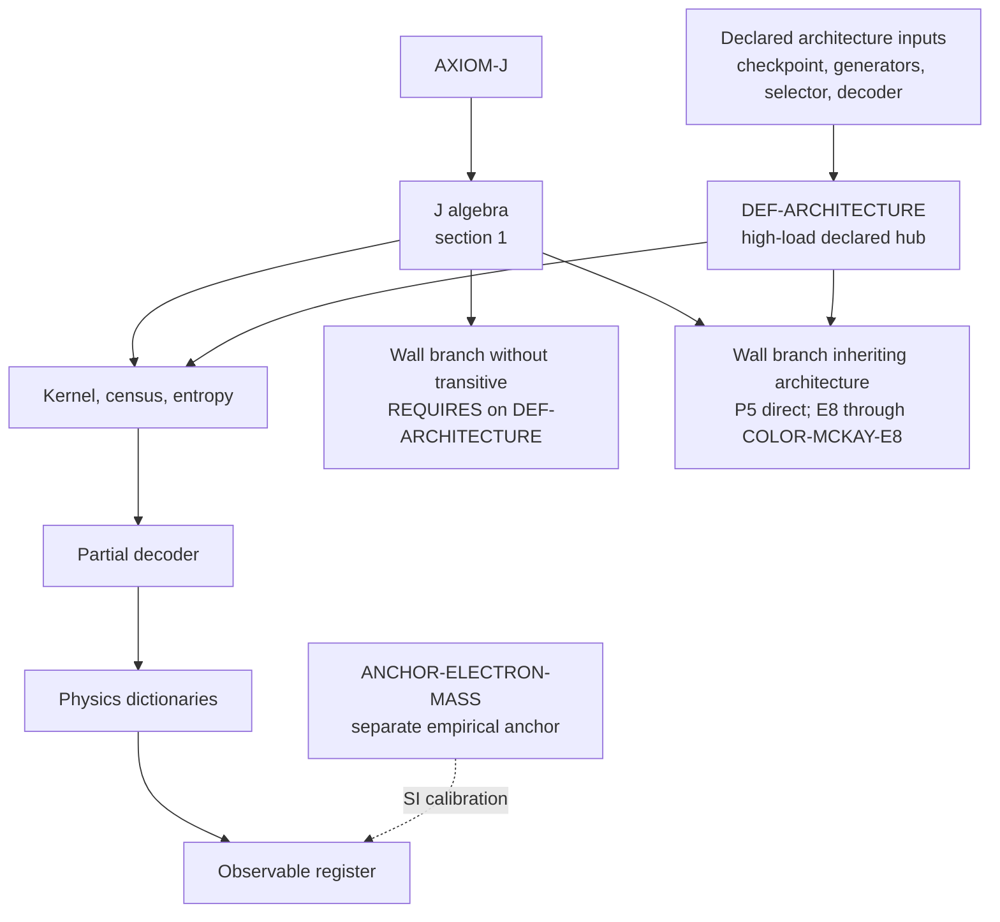

# Architecture map audit: graph corrections and the first safe ledger patch

Date: 2026-07-18. Review target:
`notes/ARCHITECTURE_MAP_2026-07-18.md` on
`claude/twist-j-architecture-physics-bca8ck`.

**NON-CANONICAL.** This is a review and correction note. It changes no claim,
status, scope, evidence class, or public dependency. The registry and companion
ledgers remain authoritative.

## Verdict

The map is useful and should be kept. Its core/interposer/hole distinction is
clear, the priority order is mostly sound, and the decoder section identifies
the real bottleneck. Five statements in the one-page picture must nevertheless
be tightened before the picture can be treated as an accurate projection of
the machine-readable graph.

## 1. The graph is a two-hub compression, not literally a two-root DAG

The phrase

> The dependency graph of the registry is a two-root DAG

is too strong. `NORMATIVE.tsv` contains several separately declared definition
items and a separate empirical anchor. In particular,
`ANCHOR-ELECTRON-MASS` is not part of `DEF-ARCHITECTURE`. The useful statement
is narrower:

> At this altitude the ledger is best compressed around two load-bearing
> hubs: the algebraic J lane and the declared architecture lane. The literal
> dependency graph has additional terminal definition and anchor items.

The dotted arrow from the axiom to `DEF-ARCHITECTURE` should also disappear.
The Canon says that the architecture is declared beside J, not derived from J;
an arrow, even a dotted one, visually suggests a dependency that the ledger
does not claim.

## 2. Section 16 has two wall branches

The current wall box says that the Li/RH lane bypasses the architecture hub.
That is false for the whole section. The `REQUIRES` closure is mixed.

Architecture-free examples include:

- `PENTAGON-NORMALIZATION -> J-GOLDEN-BRIDGE`;
- `J-LI-TORAL-HAAR-NOGO -> J-STEP`;
- the lambda-adic no-go chain rooted at `J-RAMIFIED-CHORD`.

Architecture-inheriting examples include:

- `P5-ROOT-SELECTION -> DEF-ARCHITECTURE` directly in the current ledger;
- `J-LI-E8-SHELL-MULTIPLICITY-NOGO -> COLOR-MCKAY-E8 ->
  DEF-ARCHITECTURE`;
- `MCKAY-THETA-FUNCTIONAL-CALCULUS-CARRIER`, which inherits the E8 chain.

`P5-ROOT-SELECTION` may be mathematically independent of the architecture, but
the map must report the present ledger rather than infer an unregistered
independence. If its blanket architecture edge is unintended, that is a
separate ledger correction.

Recommended replacement box:



This remains an orientation diagram, not a replacement for
`DEPENDENCIES.tsv`.

## 3. The number 159 describes direct edges, not universal coverage

The map currently expands `DEF-ARCHITECTURE` to "every claim outside section
1 (159 edges)" and folds the electron-mass anchor into the same node. Replace
that with:

> `DEF-ARCHITECTURE` is the largest declared hub, with 159 direct `REQUIRES`
> edges in the anchored ledger. This is not every non-section-1 item, and the
> electron-mass calibration remains the separate item
> `ANCHOR-ELECTRON-MASS`.

This preserves the important load-bearing point without overstating the graph.

## 4. The four missing census edges must be `BOUNDED_BY`

The map correctly notices that these theorem rows quantify over the recurrent
set of 313 attractors while lacking a recorded edge to `CENSUS-313`:

- `COLOR-RETURN-D5`;
- `COLOR-TORSOR-HOLONOMY`;
- `COLOR-KIN-NORMALIZER`;
- `ELECTRON-SIGN-LAWS`.

The tightening program currently says only "record the edges." The relation
matters. `CENSUS-313` has status C, while all four consumers have status T.
`tools/check_ledger.py` forbids a theorem from `REQUIRES`-depending on a
lower-status claim. The scientifically honest relation is therefore
`BOUNDED_BY`: the theorem remains exact at its declared carrier scope, while
the exhaustiveness of that carrier is bounded by the one-architecture census.

The exact proposed rows are recorded in
`notes/canon/PATCH-CENSUS-313-DEPENDENCIES-2026-07-18.md`. They are not folded
here because the repository policy requires a separate Canon fold.

## 5. Narrow the dictionary-firewall sentence

"All physical meaning is deliberately quarantined in D rows" is a useful
slogan but literally too broad: H and O rows also contain physical conjectures
and unresolved physical obligations. A precise replacement is:

> All promoted physical identifications are quarantined in D rows. H and O
> rows may state physical hypotheses or obligations, but they do not close a
> physical reading.

## Machine check added

`tools/architecture_map_report.py` derives the following directly from the
TSV ledgers:

- status and evidence counts, checked against `STATUS_COUNTS.tsv`;
- direct and transitive `REQUIRES` dependence on `DEF-ARCHITECTURE`;
- the architecture-dependent and architecture-free section-16 partitions;
- the relation, or absence of one, from the four all-313 consumers to
  `CENSUS-313`.

Run it with:

```text
python tools/architecture_map_report.py
python tools/architecture_map_report.py --format json
python tools/architecture_map_report.py --strict
```

Default mode reports debt and exits zero. Strict mode exits one until the four
census bounds are folded, or on future count/topology drift. Malformed ledger
input exits two.

## Priority after this correction

The map's next best mathematical move remains the second-architecture replay
of the census bundle. It has higher leverage than adding digits to any
observable because the color, sign, hyperplane, and entropy lanes all quantify
over the recurrent carrier. After that, the most valuable contained theorem
attack is the all-k proof for `TIME-QUANTUM-TOWER`; the deepest structural
attack remains `ENTROPY-LAYER-BRIDGE`.
