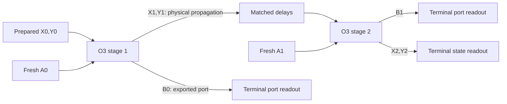

# Finite passive realization bridge 1

**NON-CANONICAL / CONSTRUCTIVE DESIGN / NO HARDWARE OR MEASUREMENT CLAIM**

This design supplies a concrete bridge from the reservoir equations to a
classical optical analogue: an explicit finite scattering matrix, an elementary
optical factorization, a two-stage circuit, and certificates separating exact
design from independently measured performance. It builds on the
[RRP1 profile](DECODER-RESERVOIR-PHYSICAL-PROFILE-1.md) and
[POC1 calibration contract](DECODER-PORT-OBSERVABLE-CALIBRATION-1.md).
The [certificate manifest](DECODER-PASSIVE-REALIZATION-BRIDGE-1.certificates.json)
records the selected design and the evidence still required.

```text
design lane: DECODER-PASSIVE-REALIZATION-BRIDGE-1, issue #832
basis_main: a2d2ee778aa0df6f8ac6712f7d87f09163af858a
authority: ACTIVE Public Canon v76
canon_content: 07910adb8418742bf52a0d204577b84b38009b18
canon_sha256: c151a19997dba95d78836c46f38463ab2735ae1c98674f87888d519d7a500112
canon_bytes: 420539
formal probe / scientific execution / physical measurement: NONE
```

The derivations below are reviewable mathematics in a design note, not newly
registered T claims or issued physical certificates. The exact circuit target
is now specified. No device instance, measured transfer or calibration data is
supplied. The scientific owner `QDD-INSTRUMENT-APPARATUS [O]`, its definition
surface #539 and the calibration lane #830 retain their open obligations.

## 1. Scope that a finite device can represent

Let B contain zero and every offset of the fixed five-shell D3 stencil.
Choose a finite domain D, ordered lexicographically, and a finite port set
R contained in D. Use the principal, zero-extension Dirichlet operator

```text
L_D=P_D L P_D^T.
```

Its diagonal remains the full `8/9`, even at the boundary. Removing the
outside edges and using the induced-subgraph Laplacian would define a different
model and introduce an unwanted constant zero mode. The quadratic form of
L_D is the full infinite-lattice edge energy of the zero extension. It is
positive definite: zero energy makes the extension constant along the connected
D3 graph, and finite support forces that constant to be zero. The stencil
degree gives `L_D <= (16/9) I` and hence

```text
0 < L_D <= (16/9)I,
M=I-L_D/4 >= (5/9)I.
```

For an initial pair `(u0,v0)`, ports R and a frozen horizon N, it is sufficient
to choose

```text
D contains (supp u0 union supp v0 union R) + N B,
```

where `N B` is the set of sums of N members of B. One induction on the local
recurrence then gives exact equality of the complete finite and infinite
zero-extended pairs and all port outputs through cut N, including arbitrary
admitted incoming port amplitudes. Each step enlarges support by at most B;
the port forcing is supported on R. This is an algebraic causal-buffer
certificate, not a claim beyond N or for every source in one fixed finite D.

The global pair energy agrees exactly with the zero-extended infinite pair.
Summing the earlier local energy densities only over D need not give this
global energy: outside density contributions require their halo or equivalent
boundary accounting. No periodic quotient or silent removal of state is used.

## 2. Exact energy coordinates and the full scattering map

Write `n=|D|`, `k=|R|`. Let P insert the k port coordinates into n site
coordinates, `G=diag(g_x)` with every `g_x in Q_(>0)`, `C=PGP^T`,
`D_g=I+C/2`, and `H=2I-L_D`.
The [pinned general reservoir law](../probes/P-DECODER-RESERVOIR-COUPLING-1/CONTRACT.md)
at source commit `550420d188a45c4929e300ca6aabcde812f4d65a` extends to this
finite symmetric Dirichlet operator as

```text
w=D_g^-1[H v-(I-C/2)u+2 P G a],
b=a-P^T(w-u)/2,
(u,v,a) -> (v,w,b).
```

Its complete rational matrix T is

```text
T = [ 0                     I                    0                 ]
    [ -D_g^-1(I-C/2)        D_g^-1 H             2 D_g^-1 P G       ]
    [ P^T D_g^-1           -P^T D_g^-1 H / 2     I-P^T D_g^-1 P G  ].
```

For pair coordinate `s=(u,v)`, put

```text
K = [ I      -H/2 ] ,      W=diag(K,2G),
    [ -H/2    I   ]
E_D(u,v)=(||v-u||^2+u^T L_D v)/2=s^T K s/2.
```

Positivity can also be seen without a matrix square root. With
`q=(u+v)/2`, `d=v-u`,

```text
E_D=(q^T L_D q+d^T M d)/2 > 0 for a nonzero pair.
```

The recurrence is exactly equivalent to

```text
q'-q=(d+d')/2,
M(d'-d)=-L_D(q+q')/2+f,
f=P G[2a-P^T(q'-q)].
```

Taking the difference of the quadratic energies gives
`Delta E_D=(q'-q)^T f=a^T G a-b^T G b`. Therefore

```text
T^T W T=W, W>0.
```

Let J be the positive square root `W^(1/2)`, and define

```text
z=J(u,v,a),  O=J T J^-1.
O^T O=I,    ||z||^2/2=E_D(u,v)+a^T G a.
```

The resulting finite real orthogonal matrix is also a complex unitary matrix.
More generally the same argument works for any fixed real invertible energy
factor J satisfying `J^T J=W`. Section 3 selects such a factor explicitly,
rather than requiring the principal square root's coordinate ordering.
All port coordinates are retained. The construction still works at `g=2`,
where discarding the outgoing port can make the reduced cold state map
singular. The complete scattering map remains invertible.

J may contain algebraic irrational entries and mix distant sites. Its use is
an explicit change of energy coordinates; it is not a passive optical device
that acts on unnormalized raw `(u,v,a)` with no preparation cost. Nor does it
identify optical channels with physical local D3 sites. The real/complex
extension is an implementation carrier; the original rational source remains
a specified subdomain, not every optical preparation.

For a proposed optical energy scale `E_star>0`, prepare energy-normalized
classical modal amplitudes

```text
alpha=sqrt(E_star/2)*z.
```

The ideal optical pulse energy `||alpha||^2` then represents
`E_star*(E_D+a^T G a)`. A physical modal normalization and calibrated source
must justify that statement experimentally. The equality of these chosen
numbers does not establish the Canon's electron-mass SI bridge.

## 3. A completely specified three-mode component

Select one Dirichlet site, `D={origin}`, one port, `L_D=8/9`, `g=2`.
This is a component demonstrator. It does not contain the five-site source
of RRP1 or the buffer needed to represent its propagating prefix.

Use

```text
X=(2 sqrt(2)/3)q,  Y=(sqrt(7)/3)d,  A=2a,
E_D+2a^2=(X^2+Y^2+A^2)/2.
```

This component uses the fixed energy factor
`J3=[[sqrt(2)/3,sqrt(2)/3,0],[-sqrt(7)/3,sqrt(7)/3,0],[0,0,2]]`.
It satisfies `J3^T J3=W3`; it is not the principal symmetric square root.
The component matrix below is `O3=J3 T3 J3^-1` for this declared basis.

The exact input/output law is

```text
[ X' ]     [ 7/9          sqrt(14)/9     sqrt(2)/3 ] [ X ]
[ Y' ]  =  [ -sqrt(14)/9  -2/9          sqrt(7)/3 ] [ Y ]
[ B  ]     [ sqrt(2)/3    -sqrt(7)/3      0        ] [ A ],

B=2b.  Call this matrix O3; O3^T O3=I and det O3=1.
```

Its optical synthesis is explicit. Define

```text
R12(alpha) = [ c -s  0 ],   R23(pi/2) = [ 1  0  0 ],
             [ s  c  0 ]                [ 0  0 -1 ]
             [ 0  0  1 ]                [ 0  1  0 ]

c=-sqrt(7)/3, s=sqrt(2)/3,
O3=R12(alpha) R23(pi/2) R12(alpha).
```

Multiplication gives rows `(c^2,-cs,s)`, `(cs,-s^2,-c)`, `(s,c,0)`,
which are exactly O3. Thus each stage requires two identical two-mode
mixers with squared coefficient magnitudes `7/9` and `2/9`, plus the signed
mode permutation. The signs and marked input/output phase conventions are
part of the design; a power-splitting ratio alone does not specify it.
The middle element can be represented by mode routing and a phase reversal.

The chosen `g=2` is a laboratory design setting, not a new derived universal
constant, an inferred natural detector parameter, or a choice made from Born
frequencies. Hardware reflectivity tolerances, physical phase settings,
wavelength, pulse shape, amplitude range and reference planes still require
an actual device definition and calibration. The ideal splitting ratio is
not a measured component certificate.

## 4. Two stages that retain state physically

Select two static copies of O3 in series. Feed the first two outputs of stage
1, without intermediate measurement or powered regeneration, to the first
two inputs of stage 2 through specified mode-preserving delays. Stage 2
has its own fresh nominally dark input. Route each exported B to a distinct
terminal output, preserving its timing and phase reference.



In fixed four-mode ordering the circuit is `O_[2]=O3_(1,2,4) O3_(1,2,3)`:
inputs `(X0,Y0,A0,A1)` become `(X2,Y2,B0,B1)`. This is an explicit orthogonal
four-mode transformation. Matched delays must include their optical phase,
group delay, bandwidth and leakage in the physical transfer certificate;
they are not silently the identity. This unrolled finite design does not
assume lossless programmable recirculation or unlimited memory.

For cold input at both stages, the state block is

```text
F=(1/9) [ 7          sqrt(14) ],    F^2=(5/9)F.
        [ -sqrt(14)  -2       ]
```

One exact proposed validation preparation is `(X0,Y0,A0,A1)=(1,0,0,0)`.
It predicts

```text
X2=35/81, Y2=-5 sqrt(14)/81,
B0=sqrt(2)/3, B1=14 sqrt(2)/27.

Fractions of launched model energy:
final state =175/729, first export =162/729, second export =392/729.
```

The fractions sum to one. They are energy targets, not event probabilities.
They are specified from the equations, not measured numbers. In particular,
intensities alone would miss the negative Y2 and relative phase information.
Additional independently launched superpositions and phase controls must test
the complete complex transfer; this one preparation cannot certify it.

For one-stage checks, terminate a separate prepared trial after its selected
cut. Do not measure a state at stage 1 and numerically reconstruct it for stage
2 while describing this as passive propagation. Any measurement tap requires
its own transfer, loss and energy accounting. End-point coherent detection is
a terminal measurement, not an invertible preservation of the original pulse.

## 5. Physical realization and certificate graph

An ideal passive multiport interferometer acts unitarily on normalized
classical electric-field modes. General unitary synthesis from two-mode
elements is established in the primary interferometer literature; our O3
factorization above does not require a universal large mesh. Loss and phase
errors are actual physical deviations to measure, not changes to the target.
[Clements et al., Background, Decomposition method and Loss tolerance](https://arxiv.org/pdf/1603.08788v2).

The optical design is a new realization proposal. It does not silently replace
POC1's mechanical force/velocity dictionary. It uses external classical optical
physics to build an analogue; demonstrating a manufactured implementation is
not evidence that the autonomous U substrate governs Nature.

| Certificate | Defined target and required evidence |
|---|---|
| C-MATH | Finite D, port order, G, horizon, exact T and W, positivity, normalization, O and any claimed RRP1 buffer. For the component these are the explicit Section 3 values. |
| C-SYNTHESIS | The displayed factor ordering, phase convention, two-stage wiring and the same input/output mode labels. Actual part identities, settings, delays and device drawings must be supplied. |
| C-SENSORS | Independent I/Q transfer, gain, relative phase/polarity, delay, filters, dynamic range, loading and uncertainty; independently calibrated pulse-energy measurement. |
| C-COMPONENTS | Unconstrained measured complex transfer matrices, losses, crosstalk, delay, drift and mode leakage. Fits must be allowed to differ from O3. |
| C-PREPARE | Intended and independently measured launched state, pulse mode/band, relative phases, source scale and dark-port background bounds. |
| C-BOUNDARY | All signal, export, loss, tap, preparation, detector and control-power ports, including the local oscillator. No unexplained replenishment of the propagating state. |
| C-HELDOUT | New predeclared inputs with unchanged readout/settings; signed complex response after one and two stages, plus independent energy balance within a frozen joint budget. |
| C-U-SOURCE | Physical meaning of the pointed U source, preparation map, admitted context, clock and SI bridge. This is distinct from every apparatus-implementation certificate above. |

The first two targets have constructive mathematical content here. They still
need the selected device instance before physical certification. None of
C-SENSORS through C-U-SOURCE is issued by this note. A calibration certificate
must identify what was measured, against which independent reference, on what
range, with which uncertainty, validity interval and retrievable evidence.
An identifier or signature without that payload is insufficient.

Designing/tuning a device toward O3 is allowed. Defining its measured transfer
to be O3, calibrating the receiver from O3, or normalizing every measured output
back to the desired energy is circular. Sensor-reference data, device setup
data and held-out validation data have separate roles and pinned membership.
Shared references retain their correlations. Calibration histories and failed
acquisitions are not silently discarded.

## 6. What to measure and how to decide

Use a fixed reference plane, mode basis, common phase reference and physical
time windows. With independent receiver calibration, coherent I/Q detection
estimates signed complex field amplitudes relative to a local oscillator.
The primary receiver literature gives the classical field interference model
and reference-signal calibration; it does not certify our receiver.
[Dennis and Nebendahl, equations 1-4 and calibration procedure](https://tsapps.nist.gov/publication/get_pdf.cfm?pub_id=911357).

Independently characterize pulse energy using a calibrated radiometric
response and its integration rule. The cited NIST work supplies one primary
method, not transferable instrument ranges or an uncertainty allowance for this
design. Squaring the same reconstructed I/Q vector is useful bookkeeping but
is not the independent energy check.
[NIST, A CW calibrated laser pulse energy meter, sections 2-3](https://tsapps.nist.gov/publication/get_pdf.cfm?pub_id=914987).

Each physical packet retains raw traces, hashes, acquisition order, dataset
role, preparation and context IDs, all calibration certificates, mode/phase
and time conventions, input/output feature estimates, joint uncertainty,
loss/background observations and validity flags. Existing inputs and acquisition
rules are pinned before a future test; new raw bytes receive custody hashes
when acquired. No hardware or data values are supplied by this design packet.

The ideal commuting diagram uses the complete input `chi=(u,v,a)` and output
`chi'=(v,w,b)`, not just the pair s, and is exact:

```text
chi --T--> chi'
 | J        | J
 z  --O-->  z'.
```

A physical comparison instead has independently defined preparation Enc,
actual optical propagation P_phys and calibrated readout Dec:

```text
Dec(P_phys(Enc(z))) = O z + r(z),
||r(z)|| <= epsilon*||z||+nu
```

on an explicitly certified mode, band, amplitude and context domain. Readout
does not erase the physical energy injected by the source or local oscillator.
A measured finite training set alone is not a proof of the displayed uniform
bound. Device characterization and model-discrepancy bounds must justify any
extrapolation; otherwise the conclusion is restricted to tested preparations.

For a cold multi-stage design let the ideal normalized state block F be a
contraction, actual block norm at stage t be bounded by L_t, block error by
epsilon_t, and additive/background contribution by nu_t. Here z_t denotes
the ideal normalized state alone, without the fresh port input, and e_t its
state error norm. If `||z_t||<=R`,

```text
e_(t+1) <= L_t*e_t + epsilon_t*R + nu_t.
```

Iteration gives product-weighted bounds. The simpler sum
`e_N<=e_0+R sum epsilon_t+sum nu_t` is justified only if the independent
physical bounds give every `L_t<=1`. Hardware passivity in energy-normalized
modes is not automatically contractivity of an arbitrary calibrated receiver
coordinate. Delays, taps, leakage and any reference-plane changes belong in
these same bounds. For an output vector of ideal norm at most R and error at
most delta, the squared-norm error is at most `2R*delta+delta^2`; apply the
physical energy factor and its correlated uncertainty as well.

A completed measurement can reject this specific device/dictionary at the
frozen scope when its residual lies outside predeclared joint bounds. Agreement
means bounded compatibility on that scope, not exact equality or proof of an
entire physical family. Missing certificates, an invalid acquisition, undefined
bounds, circular calibration or a context change produce STOP, not a fabricated
physical result. Numerical budgets and rejection predicates require their own
complete preregistration before execution. This note authorizes no test run.

Cold input means a nominated zero classical signal with measured leakage and
noise bounds. It is not a claim of exactly zero physical energy or an adoption
of quantum-vacuum statistics. If a future pointer uses `floor(heat/q)`, its
threshold and heat calibration must be independent, and a crossing is resolved
only when the entire admitted joint region gives the same integer. No ambiguous
energy measurement is rounded into a definite occurrence.

## 7. What this bridge earns and what remains

The design now has a finite target, a constructive passive factorization, a
nontrivial state-continuation circuit, exact proposed response values, and a
certificate/measurement graph that can distinguish success from failure of a
particular device. A lossless optical implementation is an ideal target; no
real apparatus is claimed exact without its physical evidence and error scope.

A digital signed record after destructive detection is not an optical tape
that can implement the inverse map. If physical reversible storage is claimed,
retain the outgoing modes for the specified horizon and certify their storage;
otherwise declare terminal detection and account for the extracted energy.
The exported field energy, absorbed detector energy and derived tape ledger are
successive accounts of the same signal, not independent energy stores. The
receiver's local oscillator and electronics have separate energy boundaries.

To scale from O3 to RRP1, choose the full five-site source, ports and horizon,
construct the finite Dirichlet buffer in Section 1, synthesize its larger O,
and repeat certificates at that same scope. A finite optical construction does
not certify the entire infinite lattice, local physical D3 geometry, an
admissible pointed-U source, the Canon SI bridge, physical reset, terminal-event
semantics or apparatus-family completeness. External optical detector laws
used for metrology are explicit inputs, not a derivation of Born occurrence.

`QDD-INSTRUMENT-APPARATUS` remains O. `COINCIDENCE-RECORD-FREQUENCY` remains
candidate-H / UNTESTED / STOP outside the registry. The photon identification
chain #744, #756 F3 and the production restriction #742 are unchanged. No new
physical effects, QDD post-state instruments, L6 measure or Canon status are
adopted. No third-party code or measurement data is imported; references support
only their explicitly named optical and metrological steps.
