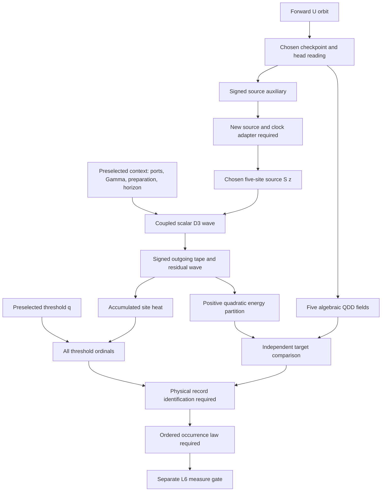

# Decoder: physical determination and Born reading

**NON-CANONICAL / ANALYTICAL PROPOSAL / PHYSICAL PROFILE STOP-DEFINITION.**

Basis: public `main` at `129a30492f263e660ea1b08dfffa3e2880e20bb9`,
ACTIVE Public Canon v76. This map changes no Canon claim, definition, gate,
or probe. The new arguments below have no formal probe result or public
status. No new scientific verifier was executed for this note.

The useful next bridge is precise: the chosen linear wave and cold reservoir
determine positive quadratic **energy shares**. A physical apparatus must
independently determine which carrier, coupling and records these describe.
A Born occurrence claim additionally needs a law for realized outcomes on
ordered preparations. These are distinct obligations, even when their final
formulas contain the same square.

## 1. What is connected, and what still needs an adapter

The current authority is [STATUS](../STATUS.md), [CORE](../canon/CORE.md)
and the exact scopes in [REGISTRY](../canon/REGISTRY.tsv). The following
completed results are public evidence but remain unregistered:

| Input | Earned mathematical scope | Boundary needed here |
|---|---|---|
| [Pointed decoder](../probes/P-DECODER-POINTED-BATCH-CONFORMANCE-1/RESULT.md), PR #821 | Prefix-consistent chosen decoder, direct QDD fields and complete A-bank incidence batches. | Its four-site wave seed and five-cell incidence record are not the later reservoir source or its channels. |
| [Retarded energy transport](../probes/P-DECODER-RETARDED-ENERGY-TRANSPORT-1/RESULT.md), PR #823 | Finite-support rational D3 propagation, positive local energy, exact current and a chosen centered five-site source. | No physical source, detector, polarization or occurrence law. |
| [Reservoir coupling](../probes/P-DECODER-RESERVOIR-COUPLING-1/RESULT.md), PR #825 | Reversible wave/port coupling; cold signed tape, exact heat budget and all threshold crossings. | Conductance, preparation, capacity, thresholds and physical identification remain choices. |

PR #825 consumes the exact pinned transport module from #823. That connection
exists. Connecting #821 to this preparation still requires a new explicit
source/clock adapter; the old profiles must not be edited or retrospectively
identified. In particular, these three output types remain distinct:

```text
QDD:                 two algebraic LOW/HIGH projector weights;
A/U5 incidence:      five cells of fresh residual pair records;
reservoir:           site/time port deposits and threshold-ordinal batches.
```

Neither equal total weight nor a common source variable identifies these
records. Raw J and B do not enter the incidence port; residual tokens are
regenerated at each cut and are not traced through updates. The
[A/U5 owner freeze](canon/C-J-A-U5-COINCIDENCE-OWNER-FREEZE.md) remains intact.
`COINCIDENCE-RECORD-FREQUENCY` stays candidate-H, outside the registry,
UNTESTED / STOP. The present energy route does not test that hypothesis.

## 2. Mathematical map with explicit branch points



The implemented #823/#825 segment starts at `S z`; the arrow from the full
orbit is an obligation, not an implemented composition. All equations in
sections 3-5 are L1 statements about that segment. Arrows toward physical
records and measure are required work, not passed layer gates.
The signed source auxiliary is read separately from the chosen head. It is
not reconstructed from the five QDD record fields: their sign quotient does
not determine a signed `z`. The new adapter must own this extra source datum
and its equality explicitly; QDD record factorization alone does not supply it.

Let `K` be the Canon's forward-orbit carrier. A frozen context `c` can index
a conditional reading `D^c` on a declared `K_c subset K`. It is not a new
input to `U`. To identify the reading of one physical system, an independent
law/dictionary must identify its `c`, or an owner must provide a typed
source-to-context map `C:K -> ContextKey` with its actual domain and totality.
We cannot silently replace `K` with `K x external_inputs`.

Different physical settings may have different contexts. If two admitted
readings of the *same* physical context give inequivalent outputs, the
independent selection/occurrence rule or physical equivalence proof is still
needed. The Canon does not require the entire reading family to be a singleton.

## 3. A quadratic partition follows from the chosen coupling

This is a proposed analytical consequence of the two completed proofs,
not a newly confirmed claim. It makes the next exact question executable
without inserting a probability target into the dynamics.

### 3.1 Source, metric and finite horizon

Write `z in Q^4`, `s=sum_i z_i`, and `e=(1,1,1,1)^T`. Define

```text
G = I_4 - e e^T/5,        m(z)=z^T G z.
S z = (z_0-s/5,z_1-s/5,z_2-s/5,z_3-s/5,-s/5)
      at sites (000),(110),(101),(011),(200), respectively.
P_0(z) = (0,S z),         E(P_0)=m(z)/2.
```

`G` is positive definite: its eigenvalues are `1/5` on `span(e)` and `1`
on `e^perp`. The rational source extension and its norm match were explicit
design choices in #823; they are not independent physical evidence.

Fix a finite positive rational conductance field `Gamma` on ports `R`,
fresh zero incoming slots and an integer horizon `n>=0`. Keep this context
independent of `z` within the compared family. The actual cold successor is

```text
w_x = [2v_x-(Lv)_x-(1-gamma_x/2)u_x]/(1+gamma_x/2),
b_(t,x) = -(w_x-u_x)/2,             x in R.
```

Every step is linear in the source and uses finite support. Thus there are
unique rational row functionals `ell_(t,x)` such that
`b_(t,x)(z)=ell_(t,x) z`. Let `P_n(z)` be the generated wave pair. Define
symmetric four-dimensional forms

```text
M_(t,x) = 2 gamma_x ell_(t,x)^T ell_(t,x),
z^T R_n z = 2 E(P_n(z)).
```

The positive local sum-of-squares density in #823 supplies a finite
sum-of-squares representation of `R_n`: substitute the linear source maps
for both slices and sum over their finite energy halo. Consequently all
`M_(t,x)` and `R_n` are positive semidefinite. From #825's exact energy law,

```text
sum_(0<=t<n, x in R) M_(t,x) + R_n = G.                  (1)
```

Indeed, the equality of the quadratic forms holds for every rational `z`;
polarization gives the matrix identity. For `n=0`, the deposit sum is empty
and `R_0=G`. This argument does not presume complete absorption or a limit
as `n` tends to infinity. It does not apply unchanged to externally supplied
nonzero incoming amplitudes or a source-dependent conductance.

### 3.2 Normalized energy shares

Any preselected partition of the finite site/time slots gives group forms
`M_j` by addition. Retain the residual as a separate group `M_res=R_n`.
For `z!=0`, put

```text
w_j(z)=z^T M_j z / (z^T G z),       sum_j w_j(z)=1.      (2)
```

These are normalized energy shares. A deposit group's share is its heat
divided by the initial wave energy; the residual share is `E(P_n)/E(P_0)`.
At zero source the ratios are undefined and a separate ZERO disposition is
required; the existing mathematical wave/threshold history is identically
zero and emits empty batches.

An optional rational operator spelling is

```text
F_j=G^(-1) M_j,       rho_z=z z^T G/(z^T G z),
sum_j F_j=I,         tr(rho_z F_j)=w_j(z).
```

Here positivity and self-adjointness refer to the `G` inner product.
`F_j` and `rho_z` need not be symmetric in the ordinary Euclidean metric.
This is an algebraic representation on the chosen real rational source
space. It supplies neither a physical effect identifier, a post-state
instrument nor a complex/polarization carrier. The trace spelling is not
an occurrence theorem.

Discarding `R_n` and renormalizing the deposits changes (2) to a conditional
absorbed-energy statistic. It needs its own declared selection rule and zero
denominator disposition. Residual energy is also not the same as NO_CROSSINGS:
positive stored heat can remain below every threshold.

## 4. The QDD comparison has a sharp obstruction

The algebraic comparison targets, expressed in these source coordinates,
are

```text
L_QDD=e e^T/20,                 H_QDD=I_4-e e^T/4,
L_QDD+H_QDD=G,
w_LOW=(s^2/20)/m,              w_HIGH=(sum_i z_i^2-s^2/4)/m.
```

Their `G`-operator representatives are the complementary projectors
`e e^T/4` and `I_4-e e^T/4`. The targets may be used *after* an independently
frozen apparatus construction for comparison. They may not be used to choose
its source, coupling, phase or pointer and then claimed as its derivation.

### 4.1 Necessary condition for positive postprocessing

Consider the complete partition (1), with the residual retained. Freeze a
state-independent nonnegative two-output postprocessing: for each fine
group `j`, assign a coefficient `a_j in [0,1]` to LOW and `1-a_j` to HIGH.
An exact realization of the target pair on `Q^4` would require

```text
sum_j a_j M_j = L_QDD,
sum_j (1-a_j) M_j = H_QDD.                              (3)
```

The coefficients may depend on the already fixed context and horizon, but
not on the source or its desired outcome. Deterministic coarse-graining is
the special case `a_j in {0,1}`. Allowing real coefficients strengthens the
obstruction below beyond rational or deterministic processing.

If a positive fine form has nonzero value on both a pure LOW source and a
pure HIGH source, (3) is impossible. On a pure HIGH source the first target
vanishes. Nonnegativity forces that fine form's `a_j=0`. On a pure LOW
source the second target vanishes and forces `a_j=1`. These requirements
contradict each other. More generally, an effect contributing to a sharp
projector cannot leak into that projector's orthogonal source subspace.

### 4.2 Exact first-step witness in the present source geometry

Take a port at the origin with `gamma_0=2` and any horizon `n>=1`.
Other ports may be present. Put `H=2I-L`. From the frozen stencil,

```text
(H S z)_0
 = (10/9)(z_0-s/5) + (1/54) sum_(i=1)^3(z_i-s/5) - s/1620
 = h z,              h=(1421,-349,-349,-349)/1620.
```

Because `u=0` at preparation, the first outgoing row is `ell_(0,0)=-h/4`,
so `M_(0,0)=h^T h/4`. It survives in every later deposit partition. Two
balanced source vectors give

```text
z_HIGH=(1,-1,0,0):       L_QDD[z_HIGH]=0,  h z_HIGH=59/54;
z_LOW =(1, 1,1,1):       H_QDD[z_LOW] =0,  h z_LOW =187/810.
```

Both values are nonzero. The same contradiction already occurs on these
two balanced inputs, not merely on an enlarged rational domain. Additional
positive groups and the residual cannot cancel it. Grouping the mixed slot
with others before applying (3) cannot remove its positive values either.
Other conductances do not change this first origin row, since the first
successor at that site uses only its own conductance and the prepared slice.

This is a proposed exact obstruction to **state-independent nonnegative
postprocessing of this finite-horizon energy partition into the two sharp
QDD targets**, for the stated context. It is not a physical falsifier or
a no-go theorem for all apparatuses, Born laws, nonlinear record rules,
coherent amplitude transformations or differently typed measurements.
There is no new registered F result.

The full signed tape and residual wave permit inverse reconstruction of the
source. Recomputing QDD targets from that recovered source is possible
mathematically; it does not make the heat channels physical LOW/HIGH effects.
Changing the interaction before squaring amplitudes is another prospective
route, requiring a new target-independent construction and new probe.

## 5. Why threshold counts do not yet provide occurrence

For accumulated heat `H_x`, #825 fixes

```text
N_x=floor(H_x/q),       r_x=H_x-q N_x,       0<=r_x<q,
E_wave+sum_x(q N_x+r_x)=m/2.
```

One time step emits **all** newly crossed ordinals, including multiple
channels and multiple ordinals at one channel. It may also emit none.
Choosing exactly one LOW or HIGH outcome would add a new law, not decode
an existing exclusive-outcome record.

At fixed conductance and horizon, scaling `z` by rational `lambda` multiplies
all heat and wave energy by `lambda^2`. It leaves (2) invariant but generally
changes `floor(lambda^2 H_x/q)`. Therefore a normalized quadratic share and
a threshold count are different readings even before physical identification.
Repeatedly restoring the identical complete source, context and ready state
in this deterministic model restores the identical batch history. A varying
sequence needs its specified persistent state, preparation sequence or
other owned inputs; repetitions are not automatically independent trials.

Three separate levels of a Born claim must consequently be frozen:

| Level | Exact target | Still needed |
|---|---|---|
| Quadratic weights | A positive normalized family such as (2). | Exact identification of the family and its actual target domain; section 4 blocks one direct QDD identification. |
| Ordered outcomes | A total realized-event transducer, with post-state, persistence, reset and zero disposition. | A physical record dictionary, explicit outcome exclusivity/completion if claimed, and an independently selected law. |
| Frequencies or probability | A declared finite discrepancy law, asymptotic frequency statement, or normalized measure/kernel. | Preparation/context schedule, source and ready-state selection, equality, quantifiers, and the applicable layer gate. A finite tally proves no unregistered limit. |

Possible occurrence routes remain alternatives, not adopted premises:

1. **Persistent deterministic route.** Derive a state/phase update and an
   ordered discrepancy or limiting-frequency theorem from independently
   identified dynamics. Every initial-phase dependence must be retained or
   physically classified. The existing probability-keyed carry bank cannot
   supply the missing input law by being renamed a detector.
2. **Preparation-ensemble route.** Independently specify which full source
   and apparatus states recur and with what measure or frequency. Derive the
   induced output law. Selecting an input distribution to reproduce the
   target weights would insert the conclusion.
3. **Explicit physical occurrence postulate/dictionary.** State it as a new
   assumption at its earned status, provide an independent consequence and
   test, and preserve the separate realization and measure gates. Calling
   `P(j|z)=w_j(z)` a definition would not derive physical occurrences.

None is chosen by this map. No sampling impossibility is asserted.

## 6. Physical determination: concrete choices and independent checks

Each choice needs one owner, domain, equality, selection rule and evidence.
Apparatus settings and universal constants play different roles. A physical
control can be a context parameter, selected before the target experiment;
this does not establish that its value follows from J. A new universal
dimensionless constant would require explicit architecture/dictionary work.
The one-anchor Canon scope cannot be preserved by silently fitting extra
numbers. The entries below are required artifacts and prospective checks,
not measured results or newly reserved scientific gates.

| Choice | Mathematical datum now available | Physical determination and independent discriminant |
|---|---|---|
| Source and domain | Centered five-site `S z`, kicked before enabling ports. | Name the supported orbit/preparation class and a source adapter into this profile. Explain the five spatial sites and preparation convention independently of the QDD norm target. Check a predicted source-response relation outside the target Born comparison. |
| Clock and space | Integer step and selected D3 stencil. | Identify their maps from `D_geom`/`D_clock`, onset of the source and exposure horizon; supply the dimensional dictionary. Compare propagation delay/dispersion on independent inputs. The source kick is not the first damped step. |
| Coupling | Local reversible wave/port map with `Gamma`. | Identify the physical field and port variable and derive or independently calibrate their constitutive coupling. Compare pulse transfer, reflected/residual energy and response to a nonzero incoming port. Local energy conservation alone does not select this law. |
| Environment and capacity | One fresh zero slot per port per step; persistent signed tape. | Identify preparation, accessible degrees of freedom, finite capacity and conditions for re-entry/back-action. Predict behavior under an independently changed incoming state or available capacity. Zero rational amplitude is not an identified physical vacuum or temperature. |
| Threshold and pointer | Common `q>0`, site partition, all lifetime ordinals and remainders. | Identify what physical signal is accumulated, its calibrated threshold, spatial/time resolution and complete record. Predict the record change when threshold is independently changed while the coupling is fixed. `Context.quantum` is a code field name, not a photon identification. |
| Outcome and reduction | Signed tape, heat and threshold batches are distinct views. | Specify which record counts as a completed physical outcome, its equality and zero/multiple/no-event cases. Freeze a target-independent pointer/reduction before comparing LOW/HIGH. Include the full post-state and any saturation claim separately. |
| Preparation sequence | Single generated prefix and exact continuation. | State how source, context and ready phase are selected across actual preparations; distinguish continuation, passive reread and fresh reset. Test a predicted sequential dependence or discrepancy outside the fitted target. |
| Family and equality | One rational finite-port linear coupling family. | Classify every physically admitted alternative at the claimed scope, including phase, memory and outside architectures; or explicitly retain a restricted conditional claim. Compare complete laws and records, not only equal effects or equal totals. |

For a tentative dimensional dictionary write `t=n tau`, spatial coordinates
`r=ell x`, and physical energy `E_phys=E_* E_model`. The origin and value of
`tau`, `ell` and `E_*` must be supplied by existing registered calibration
or by an explicitly proposed new dictionary. Then the threshold corresponds
to `E_* q`, and every conversion must use the same energy scale. Merely
assigning units proves no calibration or source/detector realization.

There is a useful independent distinction already in #825: a passive aperture
can have positive local energy while a particular coupling deposits zero.
The inversion-odd control proves this on the general pair carrier. It must
not be described as a dark-state theorem for the narrower `S z` preparation
without an additional source-domain argument.

## 7. Apparatus manifest and photon ownership

The [#539 typed contract](canon/DEF-TYPED-APPARATUS-RECORD-CONTRACT.md)
is a reusable L4-support/L5-stream proposal, not a completed profile. Its
older motivating claim list does not supersede the v76 registry. The current
physical owner is `QDD-INSTRUMENT-APPARATUS`; both O2 children and the O1
realized-event/occurrence obligation retain their full scope.

| Required field family | Present value for this route | Artifact needed before physical adoption |
|---|---|---|
| `Source`, `SupportedSource`, source equality and support map | L1 `Q^4` source plus generated finite-support waves. | New orbit/source/clock adapter and physically owned support predicate; the balanced and rational domains must be distinguished. |
| `ContextKey`, `context_of`, `ReadyState`, ready selection/phase | Literal `Gamma,q`; zero input slots, empty tape/heat. | Physical context and selection law fixed before target comparison, including environment and ready phase. |
| Apparatus/support carriers, coupling, `prepare`, `step` | Complete conditional L1 maps in #823/#825. | Physical carrier and realization certificates and separately named source-to-support and support-to-stream gates. These map names do not fill physical IDs. |
| Effects, instruments, pointer/reduction and target comparison | Proposed forms (1); deterministic tape/heat/count views. | Independent pointer and comparison domain/equality; post-state instruments. Effect equality alone cannot determine post-state equality. |
| `Outcome`, complete `EventRecord`, field ownership and terminality | Complete mathematical batches and generated post-state. | Physical event meaning and record equality, plus the independent terminality law if QDD saturation is claimed. Terminal batch emission does not imply COMM-SAT. |
| `History`, `persist`, `reset`, ZERO support | Prefix consistency, append-only signed slots and counters; no occupied-slot reset. | Physical history equality and persistent-state law. A fresh empty apparatus is not a reset of the old one. Any excluded reset needs a typed domain/disposition reviewed against #539, with a schema change if needed: its current reset codomain has no rejection tag. No inverse-erasure law is supplied. |
| Whole family, phase equality and completeness certificates | Chosen rational linear family only. | Disposition of finite/unbounded memory, nonlinear, mixed, irrational and differently typed alternatives under one physical admissibility rule. No singleton requirement is introduced. |
| Occurrence, realized outcomes, L1-to-L5 gate, L6 boundary | `UNRESOLVED`; mathematical histories only. | O1's exact ordered law on supported preparations, relevant named physical lifts, then a separate L6 gate if measure is claimed. |

A conforming future manifest also retains carrier/field/stage/leg/bridge,
quadratic/apparatus/physics/measure/closure/obligation sections from the
[decoder completion accounting](canon/C-DECODER-POINTED-BATCH-1.md#9-completion-manifest-accounting-and-physical-requirements).
Every consumed context, clock, phase, environment and normalization must
appear in its dependency graph. `feeds_U=false` remains mandatory. Identifying
two record views requires an explicit adapter and equality; an algebraic
compression is not a physical realization certificate.

For photons, a scalar energy identity does not fill
[#744](https://github.com/mathorn1973/twist-j/issues/744). That owner still
requires the exact field-strength observable, continuation convention,
infrared pole and nonzero positive residue, rank-two transverse polarization,
normalization to the D3 tangent coefficients, and anisotropy control. The
global carrier and massless-phase Canon obligations remain separate. This
reservoir is a possible future test object for a *specified* source; it does
not identify that source with the physical photon. F3 in #756 remains
NOT_SATISFIED and production #742 remains FORBIDDEN.

## 8. Next work, with bounded decisions

The next mathematical and physical tasks can proceed independently until
their explicit comparison boundary:

1. **One new L1 probe for the induced partition and its boundary.** Freeze
   the #823/#825 dependencies, `Q^4` source, all finite rational contexts and
   finite horizons, the forms (1), zero/residual conventions, and the
   nonnegative state-independent processing class (3). Audit exact matrices
   by two independent constructions and prove the uniform identity. Include
   the first-step mixed-port obstruction as a separate conjunct with its
   exact scope. A failed matrix identity or failed stated witness must be
   preserved; it would decide this candidate, not the physical owner row.
   A new probe ID, public reservation, source pin/readback and ordinary
   two-architecture procedure are still required. This note is not that pin.
2. **One named physical profile proposal under the #539 contract.** Begin
   with source/clock/context determination and one independently justified
   constitutive port law. Freeze physical record and family equalities and
   prospective discriminants from section 6. Keep every unsupported field
   unresolved; do not stamp the existing L1 implementation READY-DEFINITION
   for L4/L5 by changing its labels. The adapter and field inventory can be
   written now without changing the completed probes.
3. **Only then, an occurrence attack on that physical profile.** Freeze the
   actual preparation sequence, outcome carrier, complete post-state,
   context/phase law, equality, finite or asymptotic quantifiers and relevant
   named gates. Test the chosen independent consequence and exact target
   law. Retain no-event, multiple-event and residual dispositions rather than
   normalizing them away. Bell claims require their own full causal contract.

The priority is to make a source-driven apparatus produce an independently
identified record, then determine its occurrence law. The quadratic bridge
helps by giving an exact comparison object and by exposing which proposed
LOW/HIGH identification already fails in a sharply bounded mathematical
class. It does not turn the open physical identifiers into partially closed
ones. Public Canon v76 and all 31 live H/O rows remain unchanged.
